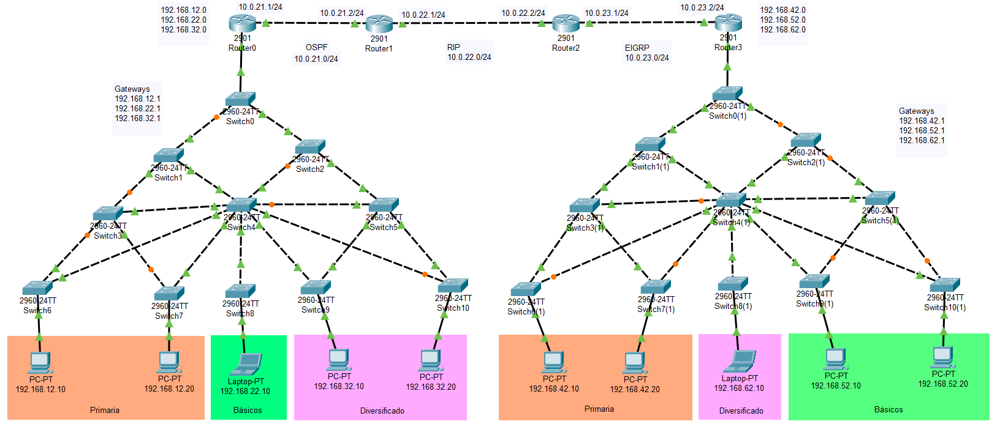
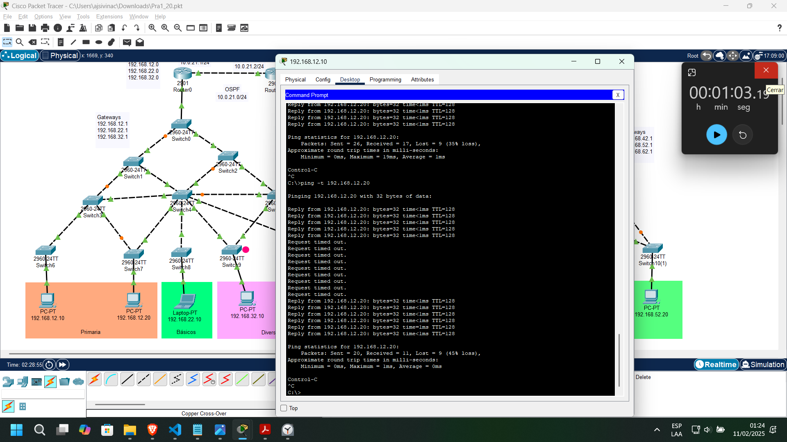
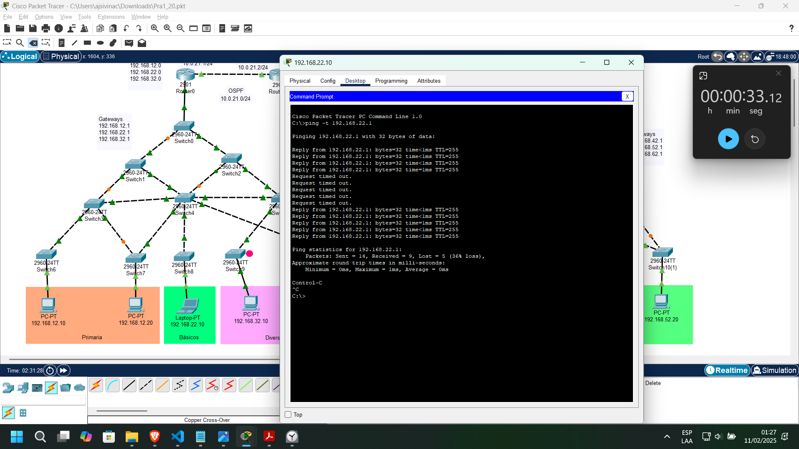
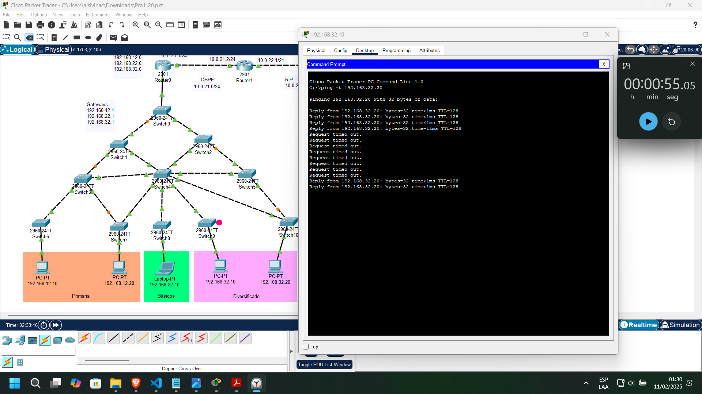

<h1 align="center">Practica 1</h1>
<div align="center">
👨‍👨‍👦 Grupo 20
</div>
<div align="center">
📕 Redes de Computadoras 2
</div>
<div align="center"> 🏛 Universidad San Carlos de Guatemala</div>
<div align="center"> 📆 Primer Semestre 2025</div>


# **📘 Manual Técnico**  

## **1️⃣ Introducción**  
### **🎯 1.1 Objetivo del documento**  
Este documento describe la implementación y configuración de la red en **Cisco Packet Tracer**, siguiendo los requerimientos establecidos en la práctica. Se detallan las configuraciones de **VLANs, VTP, STP, seguridad en puertos, enrutamiento dinámico**, y otros aspectos esenciales.  

### **🌍 1.2 Descripción del escenario**  
El colegio **Alma Mater** necesita optimizar su red, ya que ha perdido el control sobre las configuraciones previas. Se requiere la implementación de medidas para mejorar la **segmentación, seguridad y rendimiento** de la red.  

## **2️⃣ Topología de Red**  
### **🖥️ 2.1 Diagrama de Red**  


### **📌 2.2 Equipos utilizados**  
| Dispositivo | Modelo | Cantidad |  
|------------|--------|----------|  
| Switch Layer 2 | Cisco [2960-24TT] | 22 |  
| Router | Cisco [2901] | 4 |  
| PC | PC-PT | 8 |  
| Laptop | Laptop-PT | 2 |

### **🌐 2.3 Direccionamiento IP**  

- Calculo de VLAN

  - **Lado Derecho**
  - Primaria = 10 + #Grupo
  - Basicos = 20 + #Grupo
  - Diversificado = 30 + #Grupo

  - **Lado Izquierdo**
  - Primaria = 40 + #Grupo
  - Basicos = 50 + #Grupo
  - Diversificado = 60 + #Grupo

- Numero de Grupo: **20**

  - **Lado Derecho**
  - Primaria → *10 + (20) → 10 + (2+0)* = **12**
  - Basicos → *20 + (20) → 20 + (2+0)* = **22**
  - Diversificado → *30 + (20) → 30 + (2+0)* = **32**

  - **Lado Izquierdo**
  - Primaria → *40 + (20) → 40 + (2+0)* = **42**
  - Basicos → *50 + (20) → 50 + (2+0)* = **52**
  - Diversificado → *60 + (20) → 60 + (2+0)* = **62**

Cada subred tiene un esquema de direccionamiento basado en VLANs:  

| VLAN | Nombre | Dirección de Red | Máscara | Gateway |  
|------|--------|-----------------|---------|---------|  
| 12 | Primaria (izq) | 192.168.12.0/24 | 255.255.255.0 | 192.168.12.1 |  
| 22 | Básicos (izq) | 192.168.22.0/24 | 255.255.255.0 | 192.168.22.1 |  
| 32 | Diversificado (izq) | 192.168.32.0/24 | 255.255.255.0 | 192.168.32.1 |  
| 42 | Primaria (der) | 192.168.42.0/24 | 255.255.255.0 | 192.168.42.1 |  
| 52 | Básicos (der) | 192.168.52.0/24 | 255.255.255.0 | 192.168.52.1 |  
| 62 | Diversificado (der) | 192.168.62.0/24 | 255.255.255.0 | 192.168.62.1 |  

### **🌐 2.4 Configuración dirección de red PC's**


| Dispositivo | Direccion IP | Mascara de Red | VLAN | Default Gateway |
| ----------- | ------------ | -------------- | -------------- | --------------- |
| PC1 | 192.168.12.10 | 255.255.255.0 | 12 | 192.168.12.1 |
| PC2 | 192.168.12.20 | 255.255.255.0 | 12 | 192.168.12.1 |
| PC3 | 192.168.52.10 | 255.255.255.0 | 52 | 192.168.52.1 |
| PC4 | 192.168.32.10 | 255.255.255.0 | 32 | 192.168.32.1 |
| PC5 | 192.168.32.20 | 255.255.255.0 | 32 | 192.168.32.1 |
| PC6 | 192.168.42.10 | 255.255.255.0 | 42 | 192.168.42.1 |
| PC7 | 192.168.42.20 | 255.255.255.0 | 42 | 192.168.42.1 |
| PC8 | 192.168.52.20 | 255.255.255.0 | 52 | 192.168.52.1 |
| LAPTOP1 | 192.168.22.10 | 255.255.255.0 | 22 | 192.168.22.1 |
| LAPTOP2 | 192.168.62.10 | 255.255.255.0 | 62 | 192.168.62.1 |

## **3️⃣ Configuración de Dispositivos**  
### **🔧 3.1 Configuración de Switches**  
#### **📝 3.1.1 Cambio de nombre y contraseñas**  
```plaintext  
Switch> enable  
Switch# configure terminal  
Switch(config)# hostname SW1_G20  
Switch(config)# enable secret redes2grupo20  
```  

#### **📡 3.1.2 Configuración de VTP**  
```plaintext  
Switch(config)# vtp domain g20  
Switch(config)# vtp mode <server | client> 
```  


#### **🔀 3.1.3 Configuración de VLANs**  
```plaintext  
Switch(config)# vlan 12  
Switch(config-vlan)# name Primaria12  
Switch(config)# vlan 22 
Switch(config-vlan)# name Basicos22  
...  
```  

#### **🔌 3.1.4 Configuración de Trunking**  
```plaintext  
Switch(config)# interface fa0/1  
Switch(config-if)# switchport mode trunk  
Switch(config-if)# switchport trunk allowed vlan 12,22,32,42,52,62  
```  

#### **🔌 3.1.4 Desactivar el protocolo DTP de los puertos troncales**  
```plaintext  
Switch(config)# interface fa0/1  
Switch(config)# switchport nonegotiate
```  


#### **🔐 3.1.5 Configuración de Port Security y Acces mode**  
```plaintext  
Switch(config)# interface fa0/10  
Switch(config-if)# switchport mode access  
Switch(config-if)# switchport port-security  
Switch(config-if)# switchport port-security mac-address sticky  
Switch(config-if)# switchport port-security maximum 1  
Switch(config-if)# switchport port-security violation shutdown
Switch(config-if)# switchport port-security mac-address <MAC> 
```  

### **🔄 3.2 Configuración de STP (Spanning Tree Protocol)**  
#### **🌳 3.2.1 Configuración de PVST**  
```plaintext  
Switch(config)# spanning-tree mode pvst  
```  

#### **⚡ 3.2.2 Configuración de Rapid PVST**  
```plaintext  
Switch(config)# spanning-tree mode rapid-pvst  
```  

### **🚦 3.3 Configuración de Enrutamiento Dinámico**  

- Cálculo de Direcciones IP para Configuración de Protocolos de Enrutamiento
  - Numero de Grupo: **20**

| Protocolo | Fórmula de Cálculo de IP          | Resultado |
|-----------|----------------------------------|-------------------|
| OSPF      | `10.0.(1 + 20).0/24`         | `10.0.21.0/24`     |
| RIP       | `10.0.(2 + 20).0/24`         | `10.0.22.0/24`     |
| EIGRP     | `10.0.(3 + 20).0/24`         | `10.0.23.0/24`     |


#### 📡 Router 0

**Habilitar configuración**
```
enable
configure terminal
```

**Configuración de subinterfaces VLAN**

```
interface GigabitEthernet0/1
 no ip address
 no shutdown
 exit

interface GigabitEthernet0/1.12
 encapsulation dot1Q 12
 ip address 192.168.12.1 255.255.255.0
 exit

interface GigabitEthernet0/1.22
 encapsulation dot1Q 22
 ip address 192.168.22.1 255.255.255.0
 exit

interface GigabitEthernet0/1.32
 encapsulation dot1Q 32
 ip address 192.168.32.1 255.255.255.0
 exit
```

**Configuración de interfaz de red principal**

```
interface GigabitEthernet0/0
 ip address 10.0.21.1 255.255.255.0
 no shutdown
 exit
```

**Configuración del protocolo OSPF**
```
router ospf 1
 network 10.0.21.0 0.0.0.255 area 0
 network 192.168.12.0 0.0.0.255 area 0
 network 192.168.22.0 0.0.0.255 area 0
 network 192.168.32.0 0.0.0.255 area 0
 redistribute rip subnets
 exit
```


#### 📡 Router1


**Configuración de interfaces**
```
interface GigabitEthernet0/1
 ip address 10.0.22.1 255.255.255.0
 no shutdown
 exit

interface GigabitEthernet0/0
 ip address 10.0.21.2 255.255.255.0
 no shutdown
 exit
```

**Configuración del protocolo OSPF**
```
router ospf 1
 network 10.0.21.0 0.0.0.255 area 0
 redistribute rip subnets
 exit
```

**Configuración del protocolo RIP**
```
router rip
 version 2
 network 10.0.22.0
 redistribute ospf 1 metric 5
 exit
```


#### 📡 Router 2

**Configuración de interfaces**
```
interface GigabitEthernet0/1
 ip address 10.0.22.2 255.255.255.0
 no shutdown
 exit

interface GigabitEthernet0/0
 ip address 10.0.23.1 255.255.255.0
 no shutdown
 exit
```

**Configuración del protocolo RIP**
```
router rip
 version 2
 network 10.0.22.0
 redistribute eigrp 10 metric 5
 no auto-summary
 exit
```

**Configuración del protocolo EIGRP**
```
router eigrp 10
 network 10.0.23.0 0.0.0.255
 redistribute rip metric 100000 10 255 1 1500
 exit
```


#### 📡 Router 3


**Configuración de interfaces**
```
interface GigabitEthernet0/0
 ip address 10.0.23.2 255.255.255.0
 no shutdown
 exit

interface GigabitEthernet0/1
 no shutdown
 exit
```

**Configuración de subinterfaces VLAN**

```
interface GigabitEthernet0/1.42
 encapsulation dot1Q 42
 ip address 192.168.42.1 255.255.255.0
 no shutdown
 exit

interface GigabitEthernet0/1.52
 encapsulation dot1Q 52
 ip address 192.168.52.1 255.255.255.0
 no shutdown
 exit

interface GigabitEthernet0/1.62
 encapsulation dot1Q 62
 ip address 192.168.62.1 255.255.255.0
 no shutdown
 exit
```

**Configuración del protocolo EIGRP**
```
router eigrp 10
 network 10.0.23.0 0.0.0.255
 network 192.168.42.0 0.0.0.255
 network 192.168.52.0 0.0.0.255
 network 192.168.62.0 0.0.0.255
 redistribute rip metric 100000 10 255 1 1500
 exit
```


---

## **4️⃣ Pruebas y Validación**  
### **🖧 4.1 Verificación de Conectividad**  
Ejecutar `ping` entre hosts en distintas VLANs y entre edificios.  

### **🔎 4.2 Verificación de STP y Convergencia**  
Medir tiempos de convergencia eliminando enlaces y usando:  
```plaintext  
Switch# show spanning-tree  
```  

### **📡 4.3 Verificación de Enrutamiento**  
Comprobar las rutas con:  
```plaintext  
Router# show ip route  
```  

## **5️⃣ Resultados**  
| Escenario | Protocolo Spanning-Tree | Red Primaria | Red Básicos | Red Diversificado |
|-----------|-------------------------|--------------|------------|-------------------|
| 1         | PVST                    | 1min y 3seg       | 33 seg      | 55 seg            |
| 2         | Rapid PVST               | 0 seg       | 0 seg      | 0 seg            |

El **Escenario 2 (Rapid PVST)** es la mejor opción debido a su tiempo de convergencia instantáneo (0 segundos), lo que lo hace ideal para redes que requieren alta disponibilidad, eficiencia y una experiencia de usuario sin interrupciones. Además, al ser una versión mejorada de PVST, ofrece mayor robustez y adaptabilidad en entornos de red modernos. Por estas razones, se recomienda implementar el **Escenario 2** como la propuesta final


## **📷 Anexos** 

<figure>
  
  <figcaption>Figura 1: Gráfico que muestra el tiempo de convergencia de la red <code>Primaria</code> después de la caída de un enlace entre Swithc 6 y Swithc 4.</figcaption>
</figure>
<br>
<br>

<figure>
  
  <figcaption>Figura 2: Gráfico que muestra el tiempo de convergencia de la red <code>Basicos</code> después de la caída de un enlace entre Swithc 4 y Swithc 9.</figcaption>
</figure>
<br>
<br>

<figure>
  
  <figcaption>Figura 3: Gráfico que muestra el tiempo de convergencia de la red <code>Diversificado</code> después de la caída de un enlace entre Swithc 5 y Swithc 9.</figcaption>
</figure>

<br>
<br>

**Nota:** La demostración de los tiempos de convergencia para la configuración Rapid-PVST (Rapid Per-VLAN Spanning Tree) no incluye una figura gráfica debido a la inmediatez del proceso de convergencia. Rapid-PVST está diseñado para alcanzar un estado estable en tiempos extremadamente cortos, lo que hace que su representación visual resulte innecesaria o poco significativa en este contexto.