<h1 align="center">Practica 2</h1>

<div align="center">
    <p>📕 Redes de Computadoras 2</p>
    <p>📆 Marzo 2025 | 🏛 Universidad de San Carlos de Guatemala | 👤 Grupo 20</p>
    <p><i>Optimización de la red cableada e inalámbrica con protocolos de capa 3</i></p>
</div>

---

## 🛠 **Tecnologías Utilizadas**

<p align="center">
  <a href="https://go-skill-icons.vercel.app/">
    
  </a>
</p>

- **Cisco Packet Tracer** (Simulación de Red)
- **HTML y CSS3** (Página Estática)
- **GitHub** (Control de Versiones)

---

## 📜 **Descripción General**

La Facultad de Ingeniería de la USAC está en proceso de modernización de su red. Se requiere la configuración de una topología que asegure **rendimiento, seguridad y escalabilidad** para conectar el edificio de la biblioteca.

- **Piso 1:** Red cableada tradicional.
- **Piso 2 y 3:** Redes WiFi con autenticación WPA2.
- **VLANs diferenciadas para administración, estudiantes, servidores web y DHCP.**
- **Asignación de direcciones IP dinámicas mediante DHCP.**
- **Implementación de protocolos OSPF**
- **Configuración de redundancia con VRRP (HSRP en Cisco).**
- **Servidor DNS y Web alojado en la biblioteca central.**

---


## 📊 **Topología**

<div align="center">
    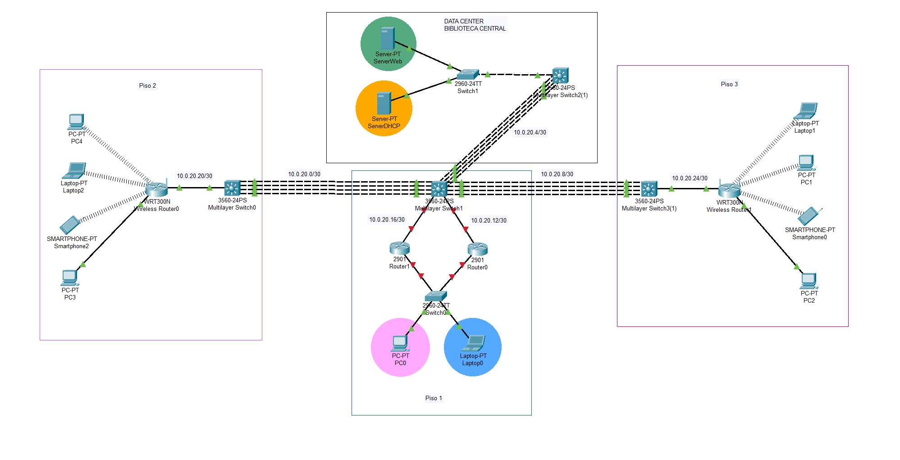
</div>

---

## 📶 **Configuraciones de VLAN e Interfaces VLAN**

Se configuran las siguientes VLANs según el número de grupo:

| VLAN | Nombre        | ID   |
|------|-------------|------|
| ADMIN       | 10 + (2+0) |  12  |
| ESTUDIANTES | 20 + (2+0) |  22  |
| WEB_SERVERS | 30 + (2+0) |  32  |
| DHCP_SERVERS| 40 + (2+0) |  42  |

Configuración de vlans en los Switch:
```bash
Switch(config)# vlan 12
Switch(config-vlan)# name ADMIN
Switch(config-vlan)# exit

Switch(config)# vlan 22
Switch(config-vlan)# name ESTUDIANTES
Switch(config-vlan)# exit

Switch(config)# vlan 32
Switch(config-vlan)# WEB_SERVERS
Switch(config-vlan)# exit

Switch(config)# vlan 42
Switch(config-vlan)# name DHCP_SERVERS
Switch(config-vlan)# exit
```

Configuracion Trunk y Access
```
interface FastEthernet0/1
switchport mode trunk
switchport trunk allowed vlan 32,42

interface Fa0/10
switchport mode access
switchport access vlan 32

interface Fa0/11
switchport mode access
switchport access vlan 42

```
---

## 📊 **Asignación de Direcciones IP y Subredes**

### Subredes `192.168.20.0/24`:

| Subred    | Nº de Hosts | VLAN (Descripción) | IP de red         | Máscara            | Primer Host     | Último Host      | Broadcast        |
|-----------|-------------|--------------------|-------------------|--------------------|-----------------|------------------|------------------|
| Subred 1  | 62          | VLAN 22 (Estudiantes) | 192.168.20.0 /26  | 255.255.255.192    | 192.168.20.1    | 192.168.20.62    | 192.168.20.63    |
| Subred 2  | 62          | WLAN.                  | 192.168.20.64 /26 | 255.255.255.192    | 192.168.20.65   | 192.168.20.126   | 192.168.20.127   |
| Subred 3  | 62          | WLAN.                  | 192.168.20.128 /26| 255.255.255.192    | 192.168.20.129  | 192.168.20.190   | 192.168.20.191   |
| Subred 4  | 14          | VLAN 12 (Admin)    | 192.168.20.192 /28| 255.255.255.240    | 192.168.20.193  | 192.168.20.206   | 192.168.20.207   |

### Subredes `192.168.100.0/24`:
| Subred    | Nº de Hosts | VLAN (Descripción)   | IP de red           | Máscara            | Primer Host       | Último Host        | Broadcast          |
|-----------|-------------|----------------------|---------------------|--------------------|-------------------|--------------------|--------------------|
| Subred 1  | 126         | VLAN 32 (Web Servers) | 192.168.100.0 /25   | 255.255.255.128    | 192.168.100.1     | 192.168.100.126    | 192.168.100.127    |
| Subred 2  | 126         | VLAN 42 (DHCP Servers)| 192.168.100.128 /25 | 255.255.255.128    | 192.168.100.129   | 192.168.100.254    | 192.168.100.255    |

### Subredes para Enrutamiento:

| Subred    | Nº de Hosts | IP de red        | Máscara            | Primer Host    | Último Host     | Broadcast       |
|-----------|-------------|------------------|--------------------|----------------|-----------------|-----------------|
| Subred 1  | 2           | 10.0.20.0 /30    | 255.255.255.252    | 10.0.20.1      | 10.0.20.2       | 10.0.20.3       |
| Subred 2  | 2           | 10.0.20.4 /30    | 255.255.255.252    | 10.0.20.5      | 10.0.20.6       | 10.0.20.7       |
| Subred 3  | 2           | 10.0.20.8 /30    | 255.255.255.252    | 10.0.20.9      | 10.0.20.10      | 10.0.20.11      |
| Subred 4  | 2           | 10.0.20.12 /30   | 255.255.255.252    | 10.0.20.13     | 10.0.20.14      | 10.0.20.15      |
| Subred 5  | 2           | 10.0.20.16 /30   | 255.255.255.252    | 10.0.20.17     | 10.0.20.18      | 10.0.20.19      |
| Subred 6  | 2           | 10.0.20.20 /30   | 255.255.255.252    | 10.0.20.21     | 10.0.20.22      | 10.0.20.23      |
| Subred 7  | 2           | 10.0.20.24 /30   | 255.255.255.252    | 10.0.20.25     | 10.0.20.26      | 10.0.20.27      |
---

## 🏗 **Configuraciones de LACP**

Para conectar edificios con 4 enlaces LACP (configurar el lacp antes de agregar las ips):

#### 📡 Multilayer Switch0
```bash
Switch(config)# interface range fa0/1-4
Switch(config-if-range)# channel-protocol lacp
Switch(config-if-range)# channel-group 1 mode active

Switch(config)# int port-channel 1
Switch(config-if)# no sw
Switch(config-if)# ip add 10.0.0.1 255.255.255.252
```

#### 📡 Multilayer Switch1
```bash
Switch(config)# interface range fa0/1-4
Switch(config-if-range)# channel-protocol lacp
Switch(config-if-range)# channel-group 1 mode active

Switch(config)# int port-channel 1
Switch(config-if)# no sw
Switch(config-if)# ip add 10.0.0.2 255.255.255.252

##############

Switch(config)# interface range fa0/9-12
Switch(config-if-range)# channel-protocol lacp
Switch(config-if-range)# channel-group 2 mode active

Switch(config)# int port-channel 2
Switch(config-if)# no sw
Switch(config-if)# ip add 10.0.0.5 255.255.255.252

##############

Switch(config)# interface range fa0/5-8
Switch(config-if-range)# channel-protocol lacp
Switch(config-if-range)# channel-group 3 mode active

Switch(config)# int port-channel 3
Switch(config-if)# no sw
Switch(config-if)# ip add 10.0.0.9 255.255.255.252

```

#### 📡 Multilayer Switch2
```bash
Switch(config)# interface range fa0/1-4
Switch(config-if-range)# channel-protocol lacp
Switch(config-if-range)# channel-group 2 mode active

Switch(config)# int port-channel 2
Switch(config-if)# no sw
Switch(config-if)# ip add 10.0.0.6 255.255.255.252
```

#### 📡 Multilayer Switch3
```bash
Switch(config)# interface range fa0/1-4
Switch(config-if-range)# channel-protocol lacp
Switch(config-if-range)# channel-group 3 mode active

Switch(config)# int port-channel 3
Switch(config-if)# no sw
Switch(config-if)# ip add 10.0.0.10 255.255.255.252
```

---

## 🌍 **Configuración DHCP**

### 🖥️ Conexión cableada
#### 🧩 Vlan Admin

<div align="center">
    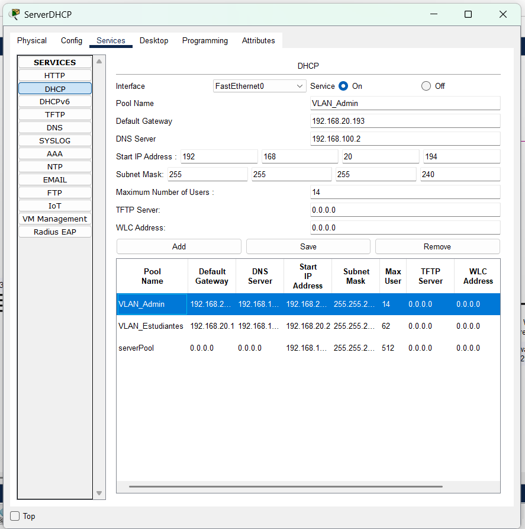
</div>

#### 🧩 Vlan Estudiantes

<div align="center">
    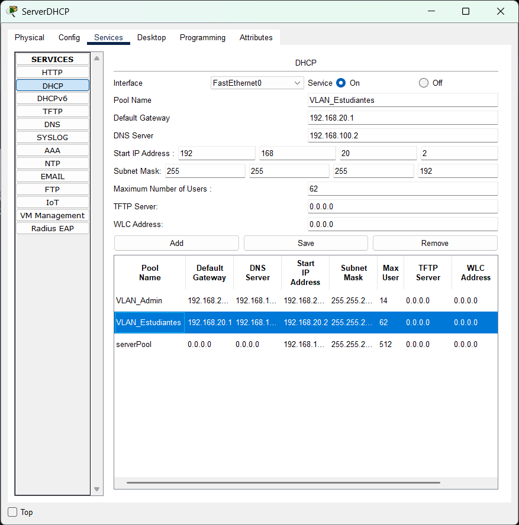
</div>

### 🛜 Conexión Wireless
#### 🧩 Router 0

<div align="center">
    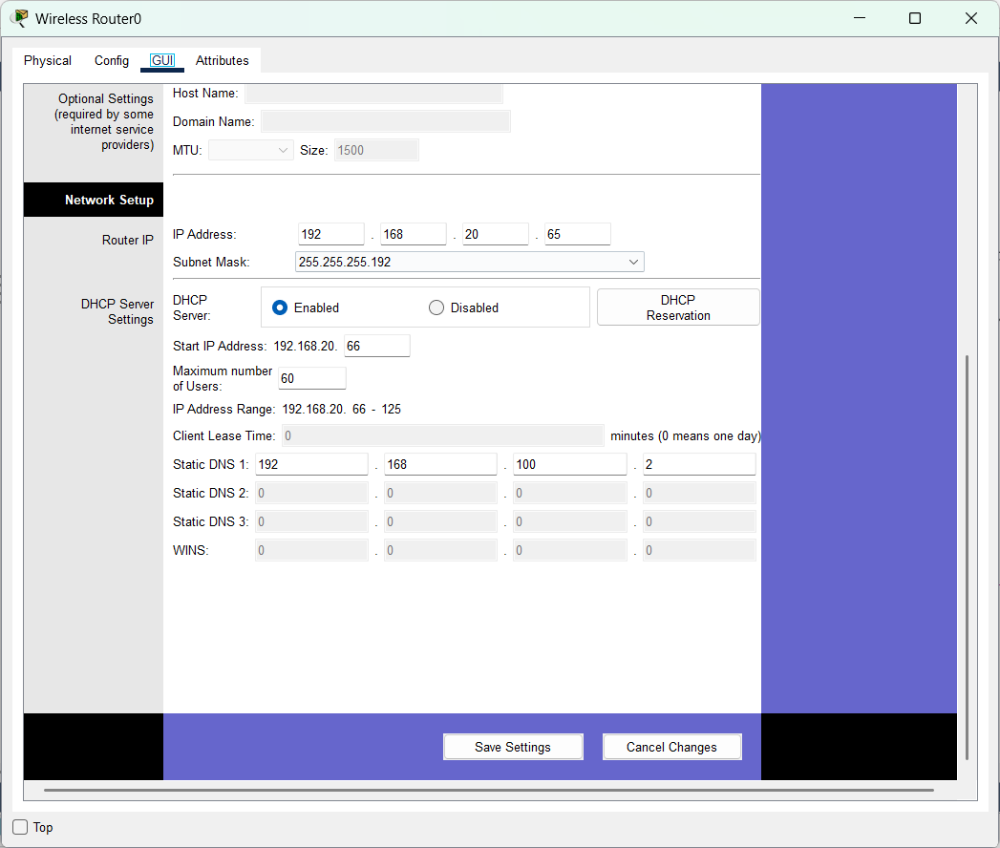
</div>

#### 🧩 Router 1

<div align="center">
 
</div>
---

## 🌍 **Configuración DNS y HTTP**

El servidor web debe responder al dominio:
```bash
www.practica2_Grupo20.com
```

<div align="center">
    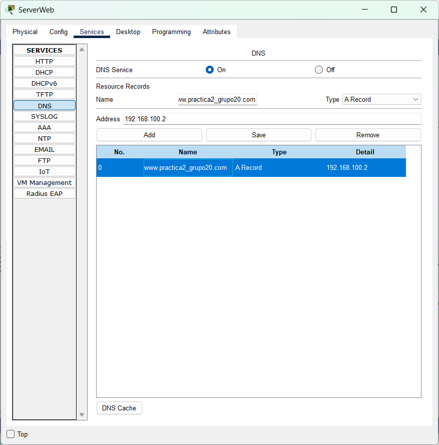
    <br/>
    <span>Configuración del DNS</span>
    <br/>
    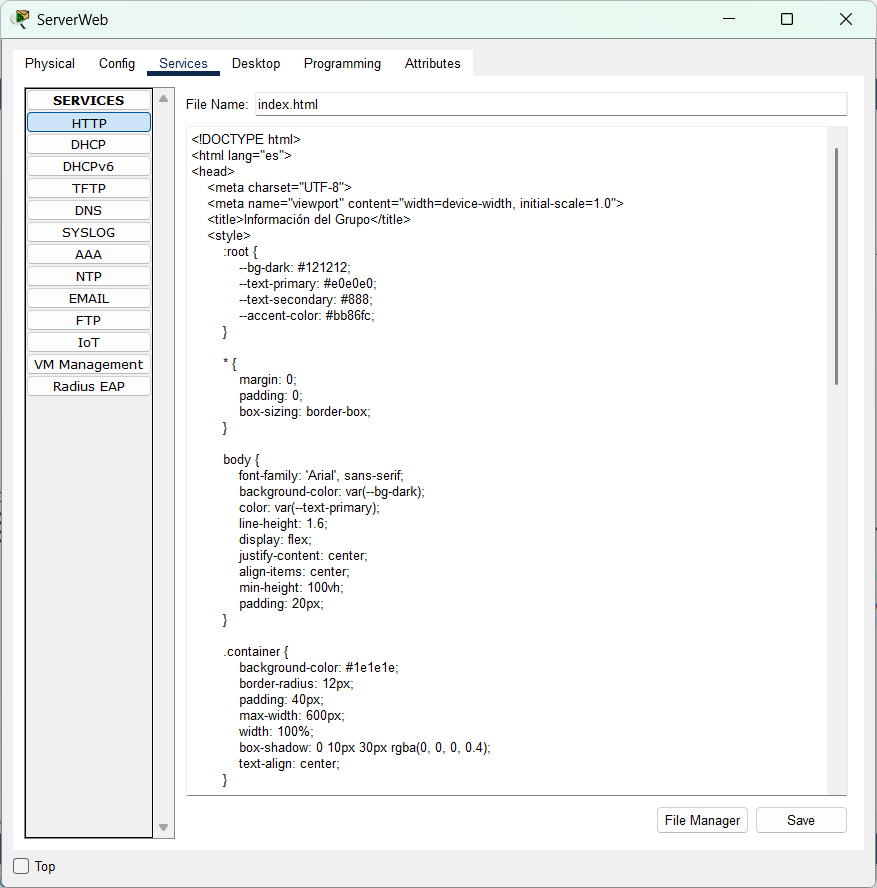
    <br/>
    <span>Configuración del index en http</span>
    <br/>
</div>

> [!NOTE]  
> **Página web estática**
>
> [👁 Ver](https://github.com/brandonT2002/REDES2_1S2025_G20/blob/main/Practica%202/src/index.html)


---

## 🔄 **Configuraciones de Protocolo de Capa 3**

#### 🧩 Multilayer Switch0
```bash
Switch(config)# router ospf 1
Switch(config-router)# network 10.0.20.0 0.0.0.3 area 0
Switch(config-router)# network 10.0.20.20 0.0.0.3 area 0
```

#### 🧩 Multilayer Switch1
```bash
Switch(config)# router ospf 1
Switch(config-router)# network 10.0.20.0 0.0.0.3 area 0
Switch(config-router)# network 10.0.20.4 0.0.0.3 area 0
Switch(config-router)# network 10.0.20.8 0.0.0.3 area 0
Switch(config-router)# network 10.0.20.12 0.0.0.3 area 0
Switch(config-router)# network 10.0.20.16 0.0.0.3 area 0


Switch(config)# vlan 12
Switch(config-vlan)# name ADMIN
Switch(config)# vlan 22
Switch(config-vlan)# name ESTUDIANTES

Switch(config)# interface vlan 12
Switch(config-if)# ip address 192.168.20.193 255.255.255.240
Switch(config-if)# no shutdown

Switch(config)# interface vlan 22
Switch(config-if)# ip address 192.168.20.1 255.255.255.192
Switch(config-if)# no shutdown

```

#### 🧩 Multilayer Switch2
```bash
Switch(config)# router ospf 1
Switch(config-router)# network 10.0.20.4 0.0.0.3 area 0
Switch(config-router)# network 192.168.100.0 0.0.0.127 area 0
Switch(config-router)# network 192.168.100.128 0.0.0.127 area 0
Switch(config-router)# network 192.168.20.0 0.0.0.63 area 0
```

#### 🧩 Multilayer Switch3
```bash
Switch(config)# router ospf 1
Switch(config-router)# network 10.0.20.8 0.0.0.3 area 0
Switch(config-router)# network 10.0.20.24 0.0.0.3 area 0
```

---


## 🔄 **Configuración HSRP**
#### 🧩 ROUTER 1 VLAN 12
```
en
conf t
interface g0/1.12
encapsulation dot1Q 12
ip address 192.168.20.194 255.255.255.240
ip helper-address 192.168.100.130
standby 1 ip 192.168.20.193
standby 1 priority 150
standby 1 preempt
```

#### 🧩 ROUTER 1 VLAN 22
```
en
conf t
interface g0/1.22
encapsulation dot1Q 22
ip address 192.168.20.2 255.255.255.192
ip helper-address 192.168.100.130
standby 2 ip 192.168.20.1
standby 2 priority 150
standby 2 preempt
```


#### 🧩 ROUTER 2 VLAN 12
```
en
conf t
interface g0/1.12
encapsulation dot1Q 12
ip address 192.168.20.195 255.255.255.240
ip helper-address 192.168.100.130
standby 1 ip 192.168.20.193
```

#### 🧩 ROUTER 2 VLAN 22
```
en
conf t
interface g0/1.22
encapsulation dot1Q 22
ip address 192.168.20.3 255.255.255.192
ip helper-address 192.168.100.130
standby 2 ip 192.168.20.1
```


---

## 📡 **Configuración de Redes Inalámbricas**

| Piso  | SSID        | Seguridad | Contraseña  |
|------|------------|------------|-------------|
| 2    | PISO_2_G20  | WPA2       | G20_PISO2    |
| 3    | PISO_3_G20  | WPA2       | G20_PISO3    |

### DHCP para Routers WiFi

|Descripción|Piso2|Piso3|
|-|-|-|
|IP Address|10.0.20.22|10.0.20.26|
|Dirección de Router|192.168.20.65|192.168.20.129|
|Máscara de Subred|255.255.255.192|255.255.255.192|
|Rango DHCP|192.168.20.66 - 125|192.168.20.129 - 188|
|DNS|192.168.100.2|192.168.100.2|

---

## 📷 **Capturas**

<div align="center">
    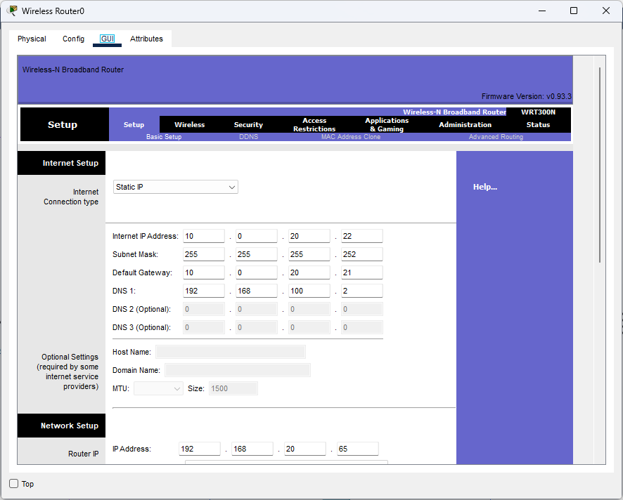
    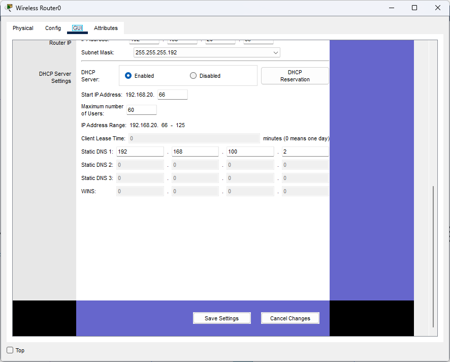
    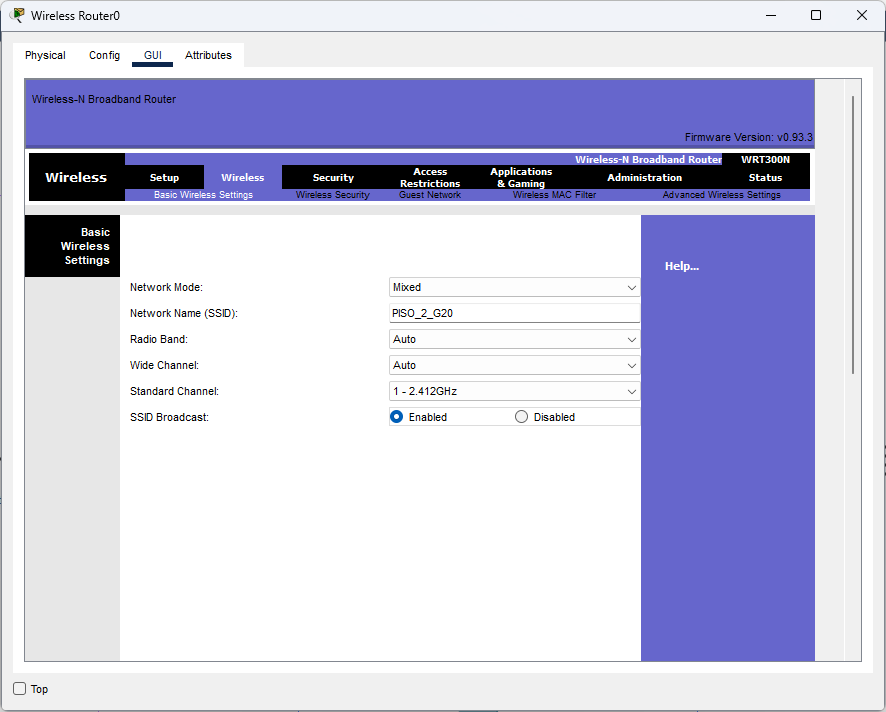
    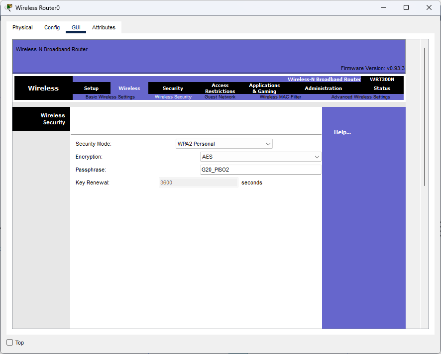
    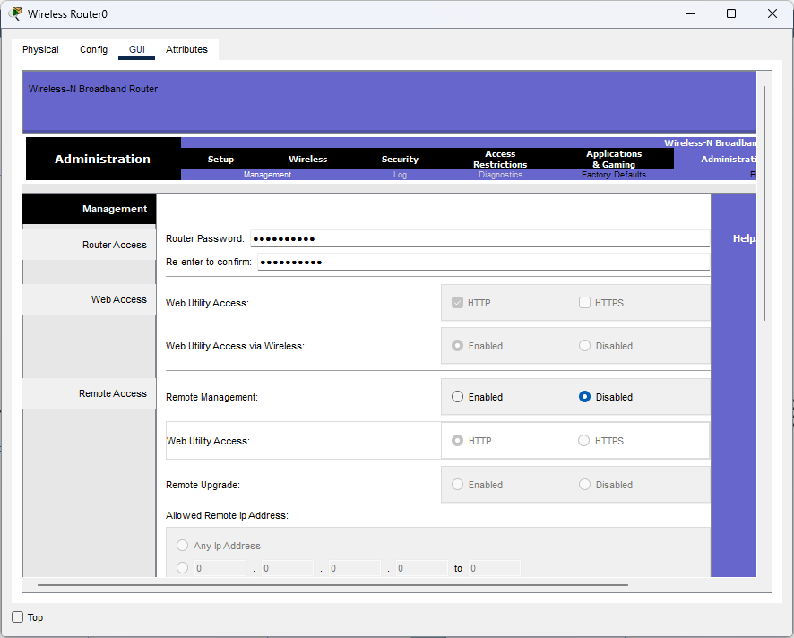
    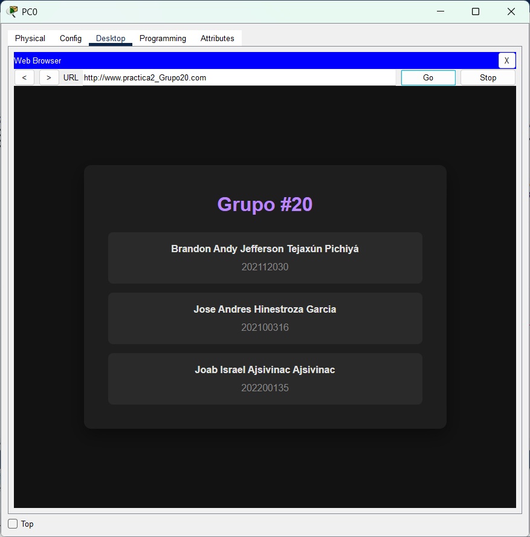
</div>


