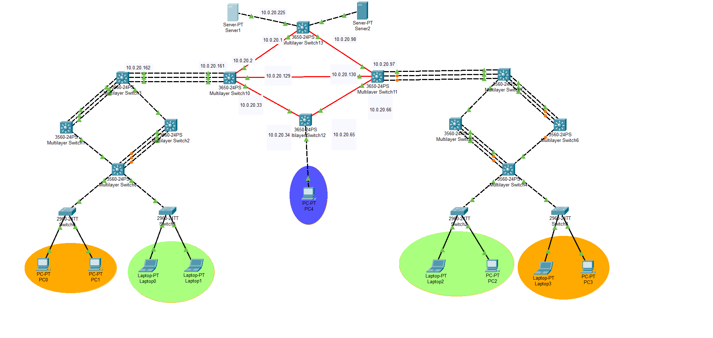

<h1 align="center">Proyecto 1</h1>
<div align="center">
👨‍👨‍👦 Grupo 20
</div>
<div align="center">
📕 Redes de Computadoras 2
</div>
<div align="center"> 🏛 Universidad San Carlos de Guatemala</div>
<div align="center"> 📆 Primer Semestre 2025</div>

## 🎯 **Objetivos del Proyecto**
- Realizar las configuraciones de switches multicapa y capa 2.
- Implementar los protocolos de capa 3: RIP, OSPF, EIGRP y BGP.
- Aplicar los conocimientos de redes MAN, LAN y WAN.
- Aplicar los conocimientos de LACP y PAGP.
- Implementar ACL's.
- Familiarizarse con las configuraciones de DHCP y sus conceptos.

---

## 🌐 **Topología de la Red**
### Descripción de la topología propuesta:
- **Edificios conectados**: 4 edificios conectados mediante switches Cisco 3650 de 24 puertos por fibra.
- **Protocolos de enrutamiento**: OSPF para el core y EIGRP para los switches externos
- **VLANs**: 5 vlans en total
- **Data Center**: Un edificio actúa como data center principal con 2 servidores DHCP.

### Diagrama de la topología:


---

## 📊 **Asignación de Direcciones IP y Subredes**

### Subredes para VLANs:

| No. VLAN | VLAN                         | Subred          | Rango                  | Broadcast       | Máscara de Subred |
|----------|------------------------------|-----------------|------------------------|-----------------|-------------------|
| 2        | VLAN_Verde_EdificioIZQ_20    | 192.168.20.0/27 | 192.168.20.1 - 192.168.20.30 | 192.168.20.31 | 255.255.255.224   |
| 3        | VLAN_Naranja_EdificioIZQ_20  | 192.168.20.32/27| 192.168.20.33 - 192.168.20.62 | 192.168.20.63 | 255.255.255.224   |
| 4        | VLAN_Verde_EdificioDER_20    | 192.168.20.64/27| 192.168.20.65 - 192.168.20.94 | 192.168.20.95 | 255.255.255.224   |
| 5        | VLAN_Naranja_EdificioDER_20  | 192.168.20.96/27| 192.168.20.97 - 192.168.20.126| 192.168.20.127| 255.255.255.224   |
| 6        | VLAN_Admin_20                | 192.168.20.128/27| 192.168.20.129 - 192.168.20.158| 192.168.20.159| 255.255.255.224   |

### Subredes para Enrutamiento:

| Red | Primer ip utilizable | ultima red utilizable | mascara          |
|-----|----------------------|-----------------------|-------------------|
| 1   | 10.0.20.1            | 10.0.20.30            | 255.255.255.224   |
| 2   | 10.0.20.33           | 10.0.20.62            | 255.255.255.224   |
| 3   | 10.0.20.65           | 10.0.20.94            | 255.255.255.224   |
| 4   | 10.0.20.97           | 10.0.20.126           | 255.255.255.224   |
| 5   | 10.0.20.129          | 10.0.20.158           | 255.255.255.224   |
| 6   | 10.0.20.161          | 10.0.20.190           | 255.255.255.224   |
| 7   | 10.0.20.193          | 10.0.20.222           | 255.255.255.224   |
| 8   | 10.0.20.225          | 10.0.20.226           | 255.255.255.252   |
| 9   | 10.0.20.229          | 10.0.20.230           | 255.255.255.252   |

## 🛠️ **Configuración de Dispositivos**


### Switch13
```bash
Switch> enable
Switch# configure terminal

! Configuración de VLAN
vlan 2
 name VLAN_Naranja_EdificioIZQ_20

! Configuración de la interfaz GigabitEthernet1/0/1
interface GigabitEthernet1/0/1
 no switchport
 ip address 10.0.20.225 255.255.255.252
 duplex auto
 speed auto
 exit
```

### SW10
```bash
Switch> enable
Switch# configure terminal

! Configuración de Port-channel3
interface Port-channel3
 no switchport
 ip address 10.0.20.161 255.255.255.224
 exit

! Configuración de las interfaces para LACP
interface range GigabitEthernet1/0/1 - 3
 channel-protocol lacp
 channel-group 3 mode active
 exit

! Configuración de las interfaces GigabitEthernet1/1/1, 1/1/2, 1/1/3
interface GigabitEthernet1/1/1
 no switchport
 ip address 10.0.20.2 255.255.255.224
 exit

interface GigabitEthernet1/1/2
 no switchport
 ip address 10.0.20.33 255.255.255.224
 exit

interface GigabitEthernet1/1/3
 no switchport
 ip address 10.0.20.129 255.255.255.224
 exit

! Configuración de VLAN 2
interface Vlan2
 mac-address 0001.96c2.3601
 ip address 192.168.20.1 255.255.255.224
 ip helper-address 10.0.20.226
 exit

! Configuración de EIGRP
router eigrp 1
 redistribute ospf 1 metric 10000 100 255 1 1500
 network 10.0.20.160 0.0.0.31
 auto-summary
 exit


! Configuracion OSPF
router ospf 1
    network 10.0.20.0 0.0.0.31 area 0
    network 10.0.20.32 0.0.0.31 area 0
    network 10.0.20.64 0.0.0.31 area 0
    network 10.0.20.96 0.0.0.31 area 0
    network 10.0.20.128 0.0.0.31 area 0
    network 10.0.20.160 0.0.0.31 area 0
    network 10.0.20.192 0.0.0.31 area 0
    network 192.168.20.0 0.0.0.31 area 0
    network 192.168.20.32 0.0.0.31 area 0
    network 192.168.20.64 0.0.0.31 area 0
    network 192.168.20.96 0.0.0.31 area 0
    network 192.168.20.128 0.0.0.31 area 0
exit

```

### SW3
```bash
Switch> enable
Switch# configure terminal

! Configuración de Port-channel2
interface Port-channel2
 switchport trunk allowed vlan 2-3
 switchport trunk encapsulation dot1q
 switchport mode trunk
 exit

! Configuración de Port-channel3
interface Port-channel3
 no switchport
 ip address 10.0.20.162 255.255.255.224
 exit

! Configuración de las interfaces para LACP
interface range FastEthernet0/1 - 3
 switchport trunk allowed vlan 2-3
 switchport trunk encapsulation dot1q
 switchport mode trunk
 channel-protocol lacp
 channel-group 2 mode active
 exit

interface range FastEthernet0/5 - 7
 channel-protocol lacp
 channel-group 3 mode active
 exit

! Configuración de VLAN 2 y 3
interface Vlan2
 mac-address 0001.9765.6d01
 ip address 192.168.20.1 255.255.255.224
 ip helper-address 10.0.20.226
 ip access-group 102 in
 exit

interface Vlan3
 mac-address 0001.9765.6d02
 ip address 192.168.20.33 255.255.255.224
 ip helper-address 10.0.20.226
 ip access-group 103 in
 exit

! Configuración de EIGRP
router eigrp 1
 redistribute ospf 1 metric 10000 100 255 1 1500
 network 10.0.20.160 0.0.0.31
 network 192.168.20.0 0.0.0.31
 network 192.168.32.0 0.0.0.31
 auto-summary
 exit

! Configuración de OSPF
router ospf 1
 log-adjacency-changes
 network 10.0.20.160 0.0.0.31 area 0
 exit

! Configuración de ACLs
access-list 102 permit ip 192.168.20.64 0.0.0.31 192.168.20.0 0.0.0.31
access-list 102 permit tcp 192.168.20.0 0.0.0.31 192.168.20.64 0.0.0.31 established
access-list 102 permit icmp 192.168.20.0 0.0.0.31 192.168.20.64 0.0.0.31 echo-reply
access-list 102 deny ip 192.168.20.0 0.0.0.31 192.168.20.64 0.0.0.31
access-list 102 deny ip 192.168.20.0 0.0.0.31 192.168.20.32 0.0.0.31
access-list 102 deny ip 192.168.20.0 0.0.0.31 192.168.20.128 0.0.0.31
access-list 102 permit ip any any

access-list 103 permit ip 192.168.20.64 0.0.0.31 192.168.20.32 0.0.0.31
access-list 103 permit tcp 192.168.20.32 0.0.0.31 192.168.20.64 0.0.0.31 established
access-list 103 permit icmp 192.168.20.32 0.0.0.31 192.168.20.64 0.0.0.31 echo-reply
access-list 103 deny ip 192.168.20.32 0.0.0.31 192.168.20.64 0.0.0.31
access-list 103 deny ip 192.168.20.32 0.0.0.31 192.168.20.0 0.0.0.31
access-list 103 deny ip 192.168.20.32 0.0.0.31 192.168.20.96 0.0.0.31
access-list 103 permit ip any any
```

### SW1
```bash
Switch> enable
Switch# configure terminal

! Configuración de Port-channel2
interface Port-channel2
 switchport trunk allowed vlan 2-3
 switchport trunk encapsulation dot1q
 switchport mode trunk
 exit

! Configuración de las interfaces para LACP
interface range FastEthernet0/1 - 3
 switchport trunk allowed vlan 2-3
 switchport trunk encapsulation dot1q
 switchport mode trunk
 channel-protocol lacp
 channel-group 2 mode active
 exit

! Configuración de VLAN 2
interface Vlan2
 mac-address 0006.2ae0.6001
 no ip address
 ip helper-address 10.0.20.226
 exit
```

### SW2
```bash
Switch> enable
Switch# configure terminal

! Configuración de Port-channel1
interface Port-channel1
 switchport trunk allowed vlan 2-3
 switchport trunk encapsulation dot1q
 switchport mode trunk
 exit

! Configuración de las interfaces para LACP
interface range FastEthernet0/1 - 3
 switchport trunk allowed vlan 2-3
 switchport trunk encapsulation dot1q
 switchport mode trunk
 channel-protocol lacp
 channel-group 1 mode active
 exit
```

### SW0
```bash
Switch> enable
Switch# configure terminal

! Configuración de Port-channel1
interface Port-channel1
 switchport trunk allowed vlan 2-3
 switchport trunk encapsulation dot1q
 switchport mode trunk
 exit

! Configuración de las interfaces para LACP
interface range FastEthernet0/1 - 3
 switchport trunk allowed vlan 2-3
 switchport trunk encapsulation dot1q
 switchport mode trunk
 channel-protocol lacp
 channel-group 1 mode active
 exit

! Configuración de VLAN 2 y 3
interface Vlan2
 mac-address 00e0.b087.3701
 no ip address
 ip helper-address 10.0.20.226
 exit

interface Vlan3
 mac-address 00e0.b087.3702
 no ip address
 ip helper-address 10.0.20.226
 exit
```

### SW0 (2960)
```bash
Switch> enable
Switch# configure terminal

! Configuración de DHCP
ip dhcp excluded-address 192.168.20.1 192.168.20.3
ip dhcp pool VLAN_Naranja_IZQ
 network 192.168.20.0 255.255.255.224
 default-router 192.168.20.1
 dns-server 192.168.20.2
 exit

! Configuración de las interfaces de acceso a VLAN 2
interface range FastEthernet0/10 - 11
 switchport access vlan 2
 switchport mode access
 exit
```

### SW1 (2960)
```bash
Switch> enable
Switch# configure terminal

! Configuración de DHCP
ip dhcp excluded-address 192.168.20.33 192.168.20.35
ip dhcp pool VLAN_Verde_IZQ
 network 192.168.20.32 255.255.255.224
 default-router 192.168.20.33
 dns-server 192.168.20.34
 exit

! Configuración de las interfaces de acceso a VLAN 3
interface range FastEthernet0/10 - 11
 switchport access vlan 3
 switchport mode access
 exit

```

## Switch 13
```bash
interface GigabitEthernet1/1/1
 no switchport
 ip address 10.0.20.1 255.255.255.224
 no shutdown
exit

interface GigabitEthernet1/1/2
 no switchport
 ip address 10.0.20.98 255.255.255.224
 no shutdown
exit


! Configuracion OSPF
router ospf 1
    network 10.0.20.0 0.0.0.31 area 0
    network 10.0.20.32 0.0.0.31 area 0
    network 10.0.20.64 0.0.0.31 area 0
    network 10.0.20.96 0.0.0.31 area 0
    network 10.0.20.128 0.0.0.31 area 0
    network 10.0.20.160 0.0.0.31 area 0
    network 10.0.20.192 0.0.0.31 area 0
    network 192.168.20.0 0.0.0.31 area 0
    network 192.168.20.32 0.0.0.31 area 0
    network 192.168.20.64 0.0.0.31 area 0
    network 192.168.20.96 0.0.0.31 area 0
    network 192.168.20.128 0.0.0.31 area 0
exit
```

### Switch 12 
```bash
interface GigabitEthernet1/1/1
 no switchport
 ip address 10.0.20.34 255.255.255.224
 no shutdown
exit


interface GigabitEthernet1/1/2
 no switchport
 ip address 10.0.20.65 255.255.255.224
 no shutdown
exit


! Configuracion OSPF
router ospf 1
    network 10.0.20.0 0.0.0.31 area 0
    network 10.0.20.32 0.0.0.31 area 0
    network 10.0.20.64 0.0.0.31 area 0
    network 10.0.20.96 0.0.0.31 area 0
    network 10.0.20.128 0.0.0.31 area 0
    network 10.0.20.160 0.0.0.31 area 0
    network 10.0.20.192 0.0.0.31 area 0
    network 192.168.20.0 0.0.0.31 area 0
    network 192.168.20.32 0.0.0.31 area 0
    network 192.168.20.64 0.0.0.31 area 0
    network 192.168.20.96 0.0.0.31 area 0
    network 192.168.20.128 0.0.0.31 area 0
exit

! Configuracion DHCP ADMIN
interface vlan 4
 ip address 192.168.20.65 255.255.255.224
 ip helper-address 10.0.20.225  
 no shutdown

ip dhcp pool Admin
network 192.168.20.64 255.255.255.224
default-router 192.168.20.65
dns-server 192.168.20.66
ip dhcp excluded-address 192.168.20.65 192.168.20.94


interface gig1/0/1
sw mode access 
sw access vlan 4

```

### Switch 11
``` bash
interface GigabitEthernet1/1/1
 no switchport
 ip address 10.0.20.97 255.255.255.224
 no shutdown
exit


interface GigabitEthernet1/1/2
 no switchport
 ip address 10.0.20.66 255.255.255.224
 no shutdown
exit

interface GigabitEthernet1/1/3
 no switchport
 ip address 10.0.20.130 255.255.255.224
 no shutdown
exit


! Configuracion OSPF
router ospf 1
    network 10.0.20.0 0.0.0.31 area 0
    network 10.0.20.32 0.0.0.31 area 0
    network 10.0.20.64 0.0.0.31 area 0
    network 10.0.20.96 0.0.0.31 area 0
    network 10.0.20.128 0.0.0.31 area 0
    network 10.0.20.160 0.0.0.31 area 0
    network 10.0.20.192 0.0.0.31 area 0
    network 192.168.20.0 0.0.0.31 area 0
    network 192.168.20.32 0.0.0.31 area 0
    network 192.168.20.64 0.0.0.31 area 0
    network 192.168.20.96 0.0.0.31 area 0
    network 192.168.20.128 0.0.0.31 area 0
exit
```