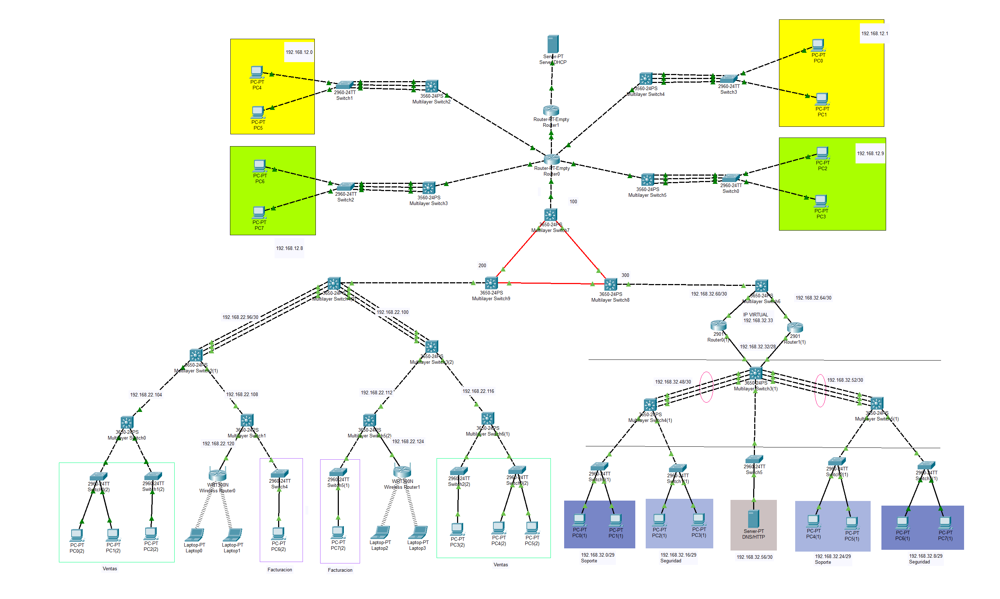
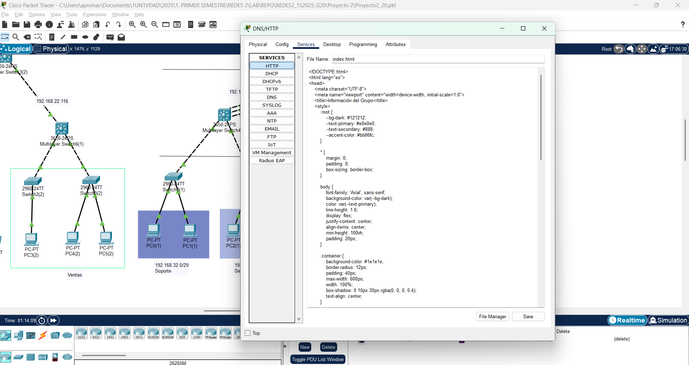
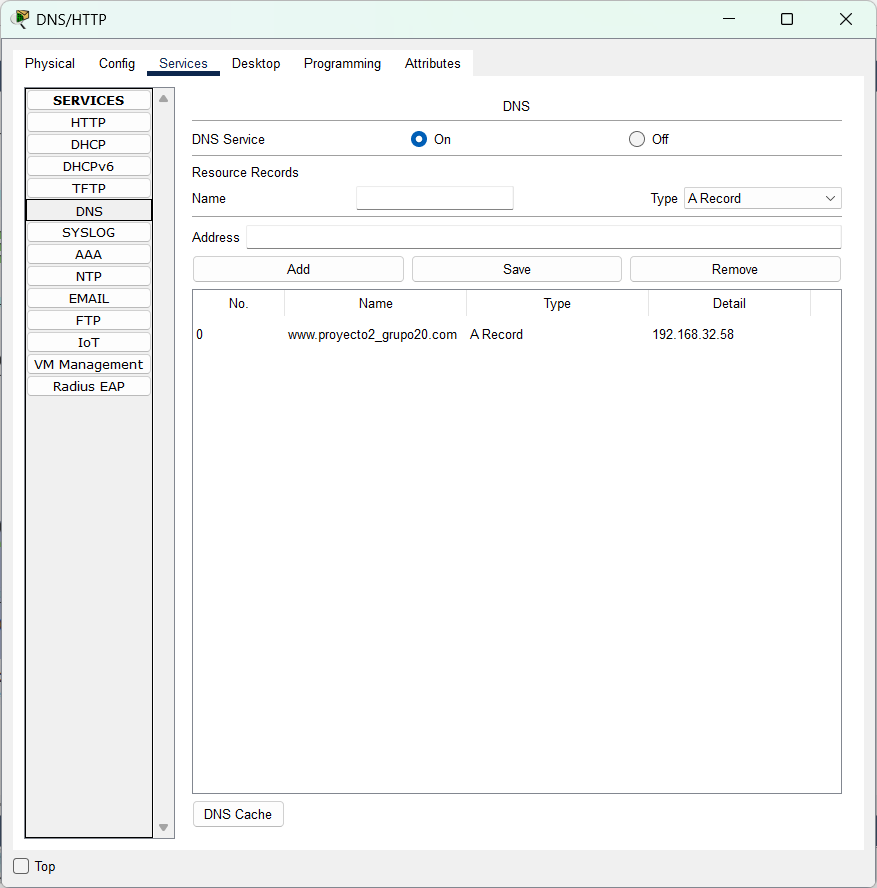

<h1 align="center">Proyecto 2</h1>

<div align="center">
    <p>📕 Redes de Computadoras 2</p>
    <p>📆 Mayo 2025 | 🏛 Universidad de San Carlos de Guatemala | 👤 Grupo 20</p>
    <p><i>Modernización de Infraestructura de Red Nacional</i></p>
</div>

---

## 🛠 **Tecnologías Utilizadas**

<p align="center">
  <a href="https://go-skill-icons.vercel.app/">
    
  </a>
</p>

- **Cisco Packet Tracer** (Simulación de Red)
- **HTML y CSS3** (Página Estática)
- **GitHub** (Control de Versiones)


## 🔍 Introducción

Este manual técnico documenta la implementación de una infraestructura de red nacional para un país con una población en rápido crecimiento y una demanda de telecomunicaciones en auge. El objetivo principal es modernizar y expandir la red nacional para mejorar la conectividad, la velocidad de transmisión y la disponibilidad de servicios digitales en todas las regiones del país.

## 🧾 Descripción del Proyecto

El proyecto tiene como finalidad diseñar e implementar una infraestructura de red nacional moderna, utilizando tecnología avanzada y buenas prácticas de ingeniería de redes. Se contemplan tres proveedores de servicios de Internet (ISP), enlaces redundantes, ruteo dinámico con BGP, direccionamiento jerárquico y políticas de control de tráfico interdepartamental.

## 🗺️ Topología General

<div align="center">
    
</div>

## 📡 Direccionamiento IP

### 📊 ISP 1

> Red Pricipal: 192.168.12.0/24

#### Tabla de Subredes Locales

| Subred               | Nº de Hosts | IP de red         | Máscara           | Primer Host     | Último Host     | Broadcast       |
|----------------------|-------------|-------------------|-------------------|-----------------|-----------------|-----------------|
| Subred 1 Atencion_Izq | 6           | 192.168.12.0 /29  | 255.255.255.248   | 192.168.12.1    | 192.168.12.6    | 192.168.12.7    |
| Subred 2 Administracion_Izq | 6 | 192.168.12.8 /29 | 255.255.255.248   | 192.168.12.9    | 192.168.12.14   | 192.168.12.15   |
| Subred 3 Atencion_Der | 6           | 192.168.12.16 /29 | 255.255.255.248   | 192.168.12.17   | 192.168.12.22   | 192.168.12.23   |
| Subred 4 Administracion_Der | 6 | 192.168.12.24 /29 | 255.255.255.248   | 192.168.12.25   | 192.168.12.30   | 192.168.12.31   |
| Subred 5 Routers     | 2           | 192.168.12.32 /30 | 255.255.255.252   | 192.168.12.33   | 192.168.12.34   | 192.168.12.35   |
| Subred 6 Server      | 2           | 192.168.12.36 /30 | 255.255.255.252   | 192.168.12.37   | 192.168.12.38   | 192.168.12.39   |
| Subred 7 Centro      | 2           | 192.168.12.40 /30 | 255.255.255.252   | 192.168.12.41   | 192.168.12.42   | 192.168.12.43   |


#### Subred Adicional

| IP de red       | Máscara           | Primer Host     | Último Host     | Broadcast       |
|-----------------|-------------------|-----------------|-----------------|-----------------|
| 192.168.32.68  | 255.255.255.252   | 192.168.32.69   | 192.168.32.70   | 192.168.32.71   |

### 📊 ISP 2

Subnetting: 

> Red Pricipal: 192.168.22.0/24

|Nombre|Hosts|ID Red|Primera IP Utilizable|Última IP Utilizable|Broadcast|Máscara de Subred|
|-|-|-|-|-|-|-|
|Ventas1|14|192.168.22.0|192.168.22.1|192.168.22.14|192.168.22.15|255.255.255.240/28|
|Ventas2|14|192.168.22.16|192.168.22.17|192.168.22.30|192.168.22.31|255.255.255.240/28|
|Facturacion1|14|192.168.22.32|192.168.22.33|192.168.22.46|192.168.22.47|255.255.255.240/28|
|Facturacion2|14|192.168.22.48|192.168.22.49|192.168.22.62|192.168.22.63|255.255.255.240/28|
|Wireless1|14|192.168.22.64|192.168.22.65|192.168.22.78|192.168.22.79|255.255.255.240/28|
|Wireless2|14|192.168.22.80|192.168.22.81|192.168.22.94|192.168.22.95|255.255.255.240/28|
|subred de conexión entre routers 1|2|192.168.22.96|192.168.22.97|192.168.22.98|192.168.22.99|255.255.255.252/30|
|subred de conexión entre routers 2|2|192.168.22.100|192.168.22.101|192.168.22.102|192.168.22.103|255.255.255.252/30|
|subred de conexión entre routers 3|2|192.168.22.104|192.168.22.105|192.168.22.106|192.168.22.107|255.255.255.252/30|
|subred de conexión entre routers 4|2|192.168.22.108|192.168.22.109|192.168.22.110|192.168.22.111|255.255.255.252/30|
|subred de conexión entre routers 5|2|192.168.22.112|192.168.22.113|192.168.22.114|192.168.22.115|255.255.255.252/30|
|subred de conexión entre routers 6|2|192.168.22.116|192.168.22.117|192.168.22.118|192.168.22.119|255.255.255.252/30|
|subred de conexión entre routers 7|2|192.168.22.120|192.168.22.121|192.168.22.122|192.168.22.123|255.255.255.252/30|
|subred de conexión entre routers 8|2|192.168.22.124|192.168.22.125|192.168.22.126|192.168.22.127|255.255.255.252/30|
|subred de conexión entre routers 9|2|192.168.22.128|192.168.22.129|192.168.22.130|192.168.22.131|255.255.255.252/30|

### 📊 ISP 3

> Red Pricipal: 192.168.32.0/24

| Subred    | Nº de Hosts | IP de red           | Máscara            | Primer Host      | Último Host      | Broadcast        | Observaciones                     |
|-----------|-------------|---------------------|--------------------|------------------|------------------|------------------|-----------------------------------|
| Soporte lado izquierdo | 6           | 192.168.32.0 /29    | 255.255.255.248    | 192.168.32.1     | 192.168.32.6     | 192.168.32.7     | Subdivisión de Subred 1 original  |
| Soporte lado Derecho | 6           | 192.168.32.8 /29    | 255.255.255.248    | 192.168.32.9     | 192.168.32.14    | 192.168.32.15    | Subdivisión de Subred 1 original  |
| Seguridad Izquierdo | 6           | 192.168.32.16 /29   | 255.255.255.248    | 192.168.32.17    | 192.168.32.22    | 192.168.32.23    | Subdivisión de Subred 2 original  |
| Seguridad Derecha | 6           | 192.168.32.24 /29   | 255.255.255.248    | 192.168.32.25    | 192.168.32.30    | 192.168.32.31    | Subdivisión de Subred 2 original  |
| HSRP  | 14          | 192.168.32.32 /28   | 255.255.255.240    | 192.168.32.33    | 192.168.32.46    | 192.168.32.47    |
| Subred 4  | 2           | 192.168.32.48 /30   | 255.255.255.252    | 192.168.32.49    | 192.168.32.50    | 192.168.32.51    |
| Subred 5  | 2           | 192.168.32.52 /30   | 255.255.255.252    | 192.168.32.53    | 192.168.32.54    | 192.168.32.55    |
| Subred 6  | 2           | 192.168.32.56 /30   | 255.255.255.252    | 192.168.32.57    | 192.168.32.58    | 192.168.32.59    |
| Subred 7  | 2           | 192.168.32.60 /30   | 255.255.255.252    | 192.168.32.61    | 192.168.32.62    | 192.168.32.63    |
| Subred 8  | 2           | 192.168.32.64 /30   | 255.255.255.252    | 192.168.32.65    | 192.168.32.66    | 192.168.32.67    |


### 📊 Core
#### Tabla de Subredes BGP

| Subred  | Nº de Hosts | IP de red      | Máscara           | Primer Host | Último Host | Broadcast    |
|---------|-------------|----------------|-------------------|-------------|-------------|--------------|
| Subred 1 | 2           | 172.20.0.0 /30 | 255.255.255.252   | 172.20.0.1  | 172.20.0.2  | 172.20.0.3   |
| Subred 2 | 2           | 172.20.0.4 /30 | 255.255.255.252   | 172.20.0.5  | 172.20.0.6  | 172.20.0.7   |
| Subred 3 | 2           | 172.20.0.8 /30 | 255.255.255.252   | 172.20.0.9  | 172.20.0.10 | 172.20.0.11  |


---

## 🔄 Configuración de Switch

### Switch Básico
```bash
# Configuración de Puertos Troncales
interface range Fa0/5 - 7
switchport mode trunk
switchport trunk allowed vlan all
channel-protocol lacp
channel-group 1 mode active
no shutdown

# Desconfiguración de puertos de acceso
interface range fa0/1-2
no switchport mode access
no switchport access vlan 10
```

### Switch Multicapa
```bash
# Configuración de Puertos Troncales
interface range Fa0/5 - 7
switchport mode trunk
switchport trunk allowed vlan all
channel-protocol lacp
channel-group 1 mode active
no shutdown

# Activación de interfaces FastEthernet
interface range fastEthernet0/1-4
no sh
exit
```

## 🏷️ Configuración de VLANs

```bash
# Definición de VLANs
vlan 10
name "AtencionAlCliente"
vlan 20
name "Administracion"

# VLANs de Redes Nacionales
vlan 15
name VENTAS
vlan 16
name FACTURACION

vlan 31
name soporte
vlan 32
name seguridad
```

### Configuración de Accesos/Troncales

#### SW0,SW3
```bash
# Configuración de puertos de acceso
interface range Fa0/11-12
switchport access vlan 15
no shutdown

# Configuración de puertos troncales
interface Fa0/1
switchport trunk encapsulation dot1q
switchport mode trunk
switchport trunk allowed vlan all
```

#### SW1,SW2
```bash
# Configuración de puertos de acceso
interface Fa0/11
switchport access vlan 15
no shutdown

# Configuración de puertos troncales
interface Fa0/1
switchport trunk encapsulation dot1q
switchport mode trunk
switchport trunk allowed vlan all
```

#### SW4,SW5
```bash
# Configuración de puertos de acceso
interface Fa0/11
switchport access vlan 16
no shutdown

# Configuración de puertos troncales
interface Fa0/1
switchport trunk encapsulation dot1q
switchport mode trunk
switchport trunk allowed vlan all
```

### Interfaces VLAN

#### SW0
```bash
interface vlan 15
ip address 192.168.22.1 255.255.255.240
ip helper-address 192.168.12.38
no shutdown
```

#### SW1
```bash
interface vlan 16
ip address 192.168.22.33 255.255.255.240
ip helper-address 192.168.12.38
no shutdown
```

#### SW5
```bash
interface vlan 16
ip address 192.168.22.49 255.255.255.240
ip helper-address 192.168.12.38
no shutdown
```

#### SW6
```bash
interface vlan 15
ip address 192.168.22.17 255.255.255.240
ip helper-address 192.168.12.38
no shutdown
```

## 🔌 Configuración LACP

### SW4
```bash
enable
configure terminal
ip routing

# Configuración Port-Channel 1
interface range Gi1/0/1-3
channel-group 1 mode active
exit
interface Port-channel1
no switchport
ip address 192.168.22.97 255.255.255.252
no shutdown

# Configuración Port-Channel 2
interface range Gi1/0/4-6
channel-group 2 mode active
exit
interface Port-channel2
no switchport
ip address 192.168.22.101 255.255.255.252
no shutdown

# Configuración de interfaz adicional
interface Gi1/0/7
no switchport
ip address 192.168.22.129 255.255.255.252
no sh
```

### SW2
```bash
enable
configure terminal
ip routing

# Configuración Port-Channel 1
interface range Gi1/0/3-5
channel-group 1 mode active
exit
interface Port-channel1
no switchport
ip address 192.168.22.98 255.255.255.252
no shutdown

# Configuración de interfaces adicionales
interface range Gi1/0/1
no switchport
ip address 192.168.22.105 255.255.255.252
no shutdown

interface range Gi1/0/2
no switchport
ip address 192.168.22.109 255.255.255.252
no shutdown
```

### SW3
```bash
enable
configure terminal
ip routing

# Configuración Port-Channel 2
interface range Gi1/0/3-5
channel-group 2 mode active
exit
interface Port-channel2
no switchport
ip address 192.168.22.102 255.255.255.252
no shutdown

# Configuración de interfaces adicionales
interface range Gi1/0/1
no switchport
ip address 192.168.22.113 255.255.255.252
no shutdown

interface range Gi1/0/2
no switchport
ip address 192.168.22.117 255.255.255.252
no shutdown
```

### Otros Switches

#### SW0
```bash
enable
configure terminal
ip routing
interface range Gi1/0/1
no switchport
ip address 192.168.22.106 255.255.255.252
no shutdown
```

#### SW1
```bash
enable
configure terminal
ip routing
interface range Gi1/0/1
no switchport
ip address 192.168.22.110 255.255.255.252
no shutdown

interface range Gi1/0/2
no switchport
ip address 192.168.22.121 255.255.255.252
no shutdown
```

#### SW5
```bash
enable
configure terminal
ip routing
interface range Gi1/0/1
no switchport
ip address 192.168.22.114 255.255.255.252
no shutdown

interface range Gi1/0/3
no switchport
ip address 192.168.22.125 255.255.255.252
no shutdown
```

#### SW0 (Adicional)
```bash
enable
configure terminal
ip routing
interface range Gi1/0/1
no switchport
ip address 192.168.22.118 255.255.255.252
no shutdown
```

## 🧭 Configuración de Enrutamiento

### Configuración EIGRP en Switches ISP2

#### SW4
```bash
router eigrp 4
network 192.168.22.96 0.0.0.3
network 192.168.22.100 0.0.0.3
network 192.168.22.128 0.0.0.3
```

#### SW2
```bash
router eigrp 4
network 192.168.22.96 0.0.0.3
network 192.168.22.104 0.0.0.3
network 192.168.22.108 0.0.0.3
```

#### SW3
```bash
router eigrp 4
network 192.168.22.100 0.0.0.3
network 192.168.22.112 0.0.0.3
network 192.168.22.116 0.0.0.3
```

#### SW0
```bash
router eigrp 4
network 192.168.22.0 0.0.0.15
network 192.168.22.104 0.0.0.3
```

#### SW1
```bash
router eigrp 4
network 192.168.22.32 0.0.0.15
network 192.168.22.108 0.0.0.3
network 192.168.22.120 0.0.0.3
```

#### SW5
```bash
router eigrp 4
network 192.168.22.48 0.0.0.15
network 192.168.22.112 0.0.0.3
network 192.168.22.124 0.0.0.3
```

#### SW6
```bash
router eigrp 4
network 192.168.22.16 0.0.0.15
network 192.168.22.116 0.0.0.3
```

### Router0
```bash
# Configuración de interfaces FastEthernet con helper para DHCP
interface fastethernet 1/0
ip address 192.168.12.1 255.255.255.248
ip helper-address 192.168.12.38
no sh

interface fastethernet 3/0
ip address 192.168.12.9 255.255.255.248
ip helper-address 192.168.12.38
no sh

interface fastethernet 4/0
ip address 192.168.12.17 255.255.255.248
ip helper-address 192.168.12.38
no sh

interface fastethernet 2/0
ip address 192.168.12.25 255.255.255.248
ip helper-address 192.168.12.38
no sh

# Configuración de enlaces WAN
interface fastethernet 0/0
ip address 192.168.12.33 255.255.255.252
no sh

interface fastethernet 5/0
ip address 192.168.12.41 255.255.255.252
no sh

# Configuración EIGRP
router eigrp 1       
network 192.168.12.0 0.0.0.7   
network 192.168.12.8 0.0.0.7  
network 192.168.12.16 0.0.0.7   
network 192.168.12.24 0.0.0.7  
network 192.168.12.32 0.0.0.3 
network 192.168.12.40 0.0.0.3
no auto-summary
```

### Router1
```bash
# Configuración de interfaces
Interface fa1/0
ip address 192.168.12.37 255.255.255.252
no sh

interface fastethernet 0/0
ip address 192.168.12.34 255.255.255.252
no sh

# Configuración EIGRP
router eigrp 1          
network 192.168.12.32 0.0.0.3 
no auto-summary
```

### ML Switch 7 (Centro)
```bash
conf t
ip routing

# Configuración de interfaces
interface GigabitEthernet 1/1/2
 no switchport
 ip address 172.20.0.1 255.255.255.252
 no shutdown

interface GigabitEthernet 1/1/1
 no switchport
 ip address 172.20.0.5 255.255.255.252
 no shutdown

interface GigabitEthernet 1/0/1
 no switchport
 ip address 192.168.12.42 255.255.255.252
 no sh

# Configuración BGP
router bgp 100
 bgp log-neighbor-changes
 no synchronization
 neighbor 172.20.0.2 remote-as 200
 neighbor 172.20.0.6 remote-as 300
 network 172.20.0.2 mask 255.255.255.252
 network 172.20.0.4 mask 255.255.255.252
 network 192.168.12.40 mask 255.255.255.252
 redistribute eigrp 1

# Configuración EIGRP
router eigrp 1       
 redistribute bgp 100 metric 10000 100 255 1 1500
 network 192.168.12.40 0.0.0.3
 no auto-summary
```

### ML Switch 8 (Centro)
```bash
conf t
ip routing

# Configuración de interfaces
interface GigabitEthernet 1/1/1
 no switchport
 ip address 172.20.0.6 255.255.255.252
 no shutdown

interface GigabitEthernet 1/1/2
 no switchport
 ip address 172.20.0.10 255.255.255.252
 no shutdown

interface GigabitEthernet 1/0/24
 no switchport
 ip address 192.168.32.69 255.255.255.252
 no shutdown

# Configuración BGP
router bgp 300
 bgp log-neighbor-changes
 no synchronization
 neighbor 172.20.0.1 remote-as 100
 neighbor 172.20.0.9 remote-as 200
 network 172.20.0.0 mask 255.255.255.252
 network 172.20.0.8 mask 255.255.255.252
 network 192.168.32.68 mask 255.255.255.252 
 redistribute ospf 20

# Configuración OSPF
router ospf 20
 log-adjacency-changes
 redistribute bgp 300 subnets
 network 192.168.32.68 0.0.0.3 area 0
```

### ML Switch 9 (Centro)
```bash
conf t
ip routing

# Configuración de interfaces
interface GigabitEthernet 1/1/1
 no switchport
 ip address 172.20.0.2 255.255.255.252
 no shutdown

interface GigabitEthernet 1/1/2
 no switchport
 ip address 172.20.0.9 255.255.255.252
 no shutdown

interface Gi1/0/7
 no switchport
 ip address 192.168.22.130 255.255.255.252
 no sh

# Configuración BGP
router bgp 200
 bgp log-neighbor-changes
 no synchronization
 neighbor 172.20.0.1 remote-as 100
 neighbor 172.20.0.10 remote-as 300
 network 172.20.0.0 mask 255.255.255.252
 network 172.20.0.8 mask 255.255.255.252
 network 192.168.22.128 mask 255.255.255.252
 redistribute eigrp 4

# Configuración EIGRP
router eigrp 4    
 redistribute bgp 200 metric 10000 100 255 1 1500
 network 192.168.22.128 0.0.0.3
 no auto-summary
```

### ML Switch 6
```bash
# Configuración de interfaces
interface GigabitEthernet 1/0/24
 no switchport
 ip address 192.168.32.70 255.255.255.252
 no shutdown

# Configuración OSPF
router ospf 20
 log-adjacency-changes
 network 192.168.32.60 0.0.0.3 area 0
 network 192.168.32.64 0.0.0.3 area 0
 network 192.168.32.68 0.0.0.3 area 0  # Subred del router red autónomo
```

---

### 🔧 **Configuraciones aplicadas en routers HSRP**

#### 1. **Asignación de nombre al dispositivo**


### 🌐 **Configuraciones en Router 0(1):**

#### 2. **Configuración de interfaces**

```bash
interface GigabitEthernet0/0
 ip address 192.168.32.34 255.255.255.240
 standby 1 ip 192.168.32.33
 standby 1 priority 150
 standby 1 preempt
 duplex auto
 speed auto
exit

interface GigabitEthernet0/1
 ip address 192.168.32.62 255.255.255.252
 duplex auto
 speed auto
exit
```

#### 3. **Activación de OSPF**

```bash
router ospf 20
 log-adjacency-changes
 network 192.168.32.32 0.0.0.15 area 0
 network 192.168.32.60 0.0.0.3 area 0
exit
```

---

### 🌐 **Configuraciones en Router1(1):**

#### 4. **Configuración de interfaces**

```bash
interface GigabitEthernet0/0
 ip address 192.168.32.35 255.255.255.240
 standby 1 ip 192.168.32.33
 duplex auto
 speed auto
exit

interface GigabitEthernet0/1
 ip address 192.168.32.66 255.255.255.252
 duplex auto
 speed auto
exit
```

> Este router no tiene `priority` ni `preempt`, por lo tanto se comporta como **backup** en HSRP.

#### 5. **Activación de OSPF**

```bash
router ospf 20
 log-adjacency-changes
 network 192.168.32.32 0.0.0.15 area 0
 network 192.168.32.64 0.0.0.3 area 0
exit
```

---

### 🔄 **Protocolo HSRP (High Availability)**

* IP virtual: `192.168.32.33`
* **Router 0** tiene mayor prioridad (`150`) y `preempt`, por lo que asume el rol de activo.
* **Router1** no tiene prioridad definida, por lo que toma el rol de respaldo.


¡Perfecto! Aquí tienes los **comandos CLI completos** que reflejan **el estado operativo final de cada dispositivo** (Router 0, Router 1, ML3, ML4, ML5), incluyendo HSRP, OSPF, VLANs, EtherChannel y helper-address. Están organizados por dispositivo.


#### 🖧 **SWITCH MULTICAPA ML3(1)**

```bash
enable
conf t
hostname ML3
ip routing

interface vlan 33
 ip address 192.168.32.57 255.255.255.248
 no shutdown

interface vlan 34
 ip address 192.168.32.36 255.255.255.240
 no shutdown

interface range g1/0/3 - 5
 channel-group 31 mode active
 no shutdown

interface range g1/0/6 - 8
 channel-group 32 mode active
 no shutdown

interface port-channel 31
 switchport mode trunk
 ip address 192.168.32.50 255.255.255.252
 no shutdown

interface port-channel 32
 switchport mode trunk
 ip address 192.168.32.54 255.255.255.252
 no shutdown

router ospf 20
 network 192.168.32.48 0.0.0.3 area 0
 network 192.168.32.52 0.0.0.3 area 0
 network 192.168.32.56 0.0.0.7 area 0
 network 192.168.32.32 0.0.0.15 area 0
```

---

#### 🖧 **SWITCH MULTICAPA ML4(1)**

```bash
enable
conf t
hostname ML4
ip routing

interface vlan 31
 ip address 192.168.32.1 255.255.255.248
 ip helper-address 192.168.32.33
 no shutdown

interface vlan 32
 ip address 192.168.32.17 255.255.255.248
 ip helper-address 192.168.32.33
 no shutdown

interface range g1/0/1 - 3
 channel-group 31 mode active
 no shutdown

interface port-channel 31
 switchport mode trunk
 ip address 192.168.32.49 255.255.255.252
 no shutdown

router ospf 20
 network 192.168.32.0 0.0.0.7 area 0
 network 192.168.32.16 0.0.0.7 area 0
 network 192.168.32.48 0.0.0.3 area 0
```

---

#### 🖧 **SWITCH MULTICAPA ML5(1)**

```bash
enable
conf t
hostname ML5
ip routing

interface vlan 31
 ip address 192.168.32.9 255.255.255.248
 ip helper-address 192.168.32.33
 no shutdown

interface vlan 32
 ip address 192.168.32.25 255.255.255.248
 ip helper-address 192.168.32.33
 no shutdown

interface range g1/0/1 - 3
 channel-group 32 mode active
 no shutdown

interface port-channel 32
 switchport mode trunk
 ip address 192.168.32.53 255.255.255.252
 no shutdown

router ospf 20
 network 192.168.32.8 0.0.0.7 area 0
 network 192.168.32.24 0.0.0.7 area 0
 network 192.168.32.52 0.0.0.3 area 0
```

### ACL

#### 🔧 **Configuración de Interfaces con ACL aplicada**

```bash
! Interfaz Fa2/0 - Red Administración 2
interface FastEthernet2/0
 description Red Administración 2
 ip address 192.168.12.25 255.255.255.248
 ip helper-address 192.168.12.38
 ip access-group BLOQUEO_HACIA_ADMIN out
 no shutdown
exit

! Interfaz Fa3/0 - Red Administración 1
interface FastEthernet3/0
 description Red Administración 1
 ip address 192.168.12.9 255.255.255.248
 ip helper-address 192.168.12.38
 ip access-group BLOQUEO_HACIA_ADMIN out
 no shutdown
exit
```

---

#### 🛡️ **Lista de Control de Acceso Extendida: BLOQUEO\_HACIA\_ADMIN**

```bash
ip access-list extended BLOQUEO_HACIA_ADMIN

 remark 🎯 Permitir ping desde Administración a otras redes
 permit icmp 192.168.12.8 0.0.0.7 any echo
 permit icmp 192.168.12.24 0.0.0.7 any echo

 remark 🔁 Permitir respuestas de ping hacia Administración
 permit icmp any 192.168.12.8 0.0.0.7 echo-reply
 permit icmp any 192.168.12.24 0.0.0.7 echo-reply

 remark 🔄 Permitir ping entre subredes de Administración
 permit icmp 192.168.12.8 0.0.0.7 192.168.12.24 0.0.0.7
 permit icmp 192.168.12.24 0.0.0.7 192.168.12.8 0.0.0.7

 remark ⛔ Bloquear ping desde otras redes hacia Administración
 deny icmp any 192.168.12.8 0.0.0.7
 deny icmp any 192.168.12.24 0.0.0.7

 remark ✅ Permitir todo lo demás
 permit ip any any
```


#### 🛡️ **Lista de Control de Acceso Extendida: BLOQUEO\ATENCION\_VENTAS**

```bash
ip access-list extended ATENCION_VENTAS
 remark --- PERMITIR DHCP ---
 permit udp any eq 68 host 192.168.12.38 eq 67
 permit udp host 192.168.12.38 eq 67 any eq 68

 remark --- ATENCION <-> VENTAS ---
 permit ip 192.168.32.0 0.0.0.15 192.168.22.0 0.0.0.31
 permit ip 192.168.22.0 0.0.0.31 192.168.32.0 0.0.0.15
 permit ip 192.168.32.16 0.0.0.15 192.168.22.0 0.0.0.31
 permit ip 192.168.22.0 0.0.0.31 192.168.32.16 0.0.0.15

 remark --- ATENCION DER <-> ATENCION IZQ ---
 permit ip 192.168.32.0 0.0.0.15 192.168.32.16 0.0.0.15
 permit ip 192.168.32.16 0.0.0.15 192.168.32.0 0.0.0.15

 remark --- NECESARIO: PERMITIR RESPUESTAS Y RUTEO BÁSICO ---
 permit icmp any any
 permit ip any host 192.168.12.38
 permit ip host 192.168.12.38 any
 permit ip any 192.168.32.0 0.0.0.31
 permit ip 192.168.32.0 0.0.0.31 any
 permit ip any any

```


## Servidor DNS/HTTP

<div align="center">
    
</div>

<div align="center">
    
</div>
